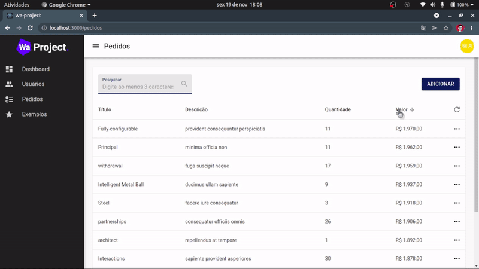
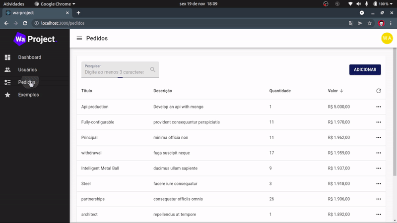
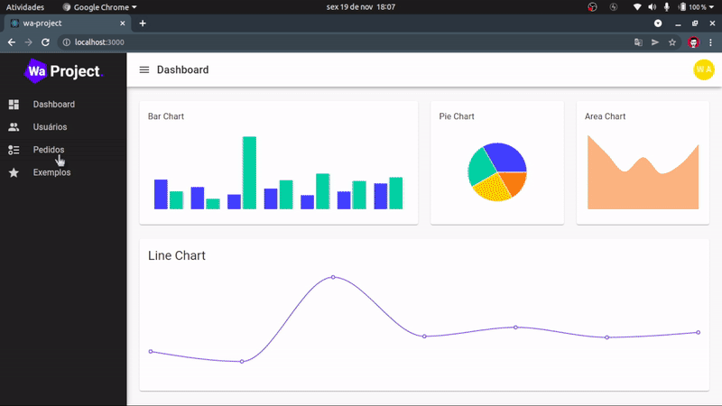
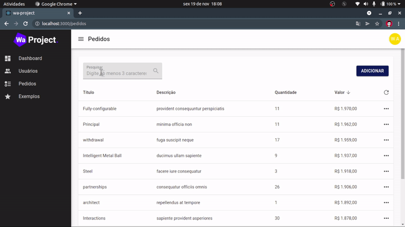

# wa-project-chalenge

- Este projeto foi criado como desafio para uma vaga de Desenvolvedor FullStack na empresa [WaProject](https://www.linkedin.com/company/waprojectconsultoria/)

- Desafio:
  - :heavy_check_mark: Deixar o projeto rodando.
  - :heavy_check_mark: Implementar uma tela para realizar pedido - Tela bem simples, pode contar apenas com descrição, quantidade e valor.
  - :heavy_check_mark: Implementar a listagem desses pedidos e a visualização dos mesmos.

## Pré Visualizações

#### Criação de Pedido

<br>


#### Deletar Pedido

<br>


#### Ordenar Pedidos

<br>

#### Procurar Pedidos


## Rodando o Projeto

- Para executar o projeto, é necessário ter os seguintes programas instalados
- :warning: Atenção: As versões aqui, foram aquelas em que usei no projeto, talvez sua versão seja compatível ou não.

  - Node v14.18.1
  - Docker v20.10.10
  - Docker-Compose v1.25.0
  - Yarn v1.22.11
<br>

- Com os programas instalados, basta clonar o projeto e na pasta principal executar os comandos

```bash
# Navegue até a pasta da API (Aplicação Back-End)
cd waproject-base-api/

# Instale as dependências
yarn install

# Execute a aplicação Back-End
sudo docker-compose up

# Agora abra outro terminal da pasta raiz do projeto e navegue até o projeto web (Aplicação Front-End)
cd waproject-base-api

# Instale as dependências
yarn install

# Execute a aplicação Front-End
yarn start
```
